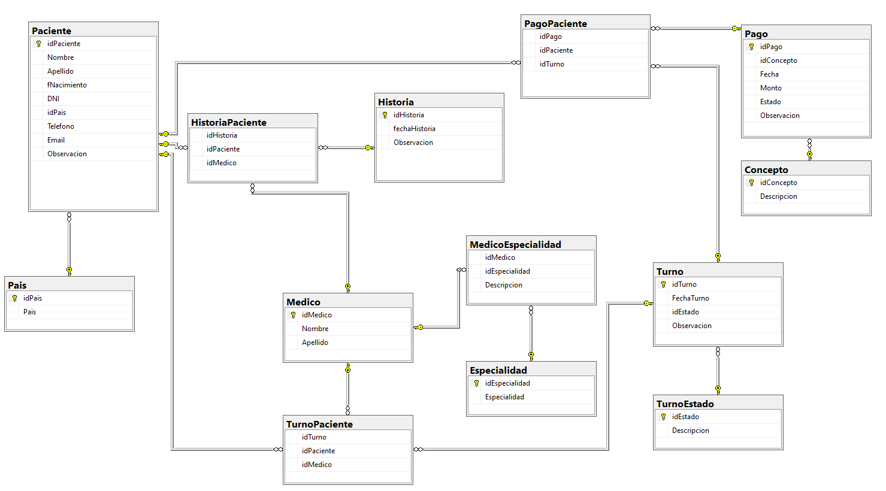

# Hospital-DB

Este repositorio contiene una colección de scripts SQL desarrollados para la gestión de pacientes, turnos médicos, médicos y especialidades dentro de una base de datos llamada **Hospital**.

---

## 📁 Proyecto SQL - Estructura de Carpetas y Scripts

1. **`1_schema/`** – Scripts para crear tablas e insertar valores iniciales  
   - `CREAR_Tablas.sql` – Crea las tablas principales del sistema.  
   - `InsertValues.sql` – Inserta valores iniciales a la base de datos. 

2. **`2_data/`** – Carga inicial de médicos u otras entidades  
   - `ALTA_Medico.sql` – Script para registrar nuevos médicos.

3. **`3_procedures/`** – Procedimientos almacenados  
   - `ALTA_Paciente.sql` – Agrega un nuevo paciente al sistema.  
   - `ALTA_Turno.sql` – Registra un nuevo turno médico.  
   - `DEL_Turno.sql` – Elimina un turno existente.  
   - `UPD_Paciente.sql` – Actualiza los datos de un paciente.  
   - `UPD_Turnos.sql` – Modifica información de un turno.  
   - `JOB_CancelaTurnoVencido.sql` – Cancela automáticamente turnos vencidos mediante un job programado.

4. **`4_functions/`** – Funciones definidas por el usuario  
   - `FCN_FechaTexto.sql` – Convierte fechas a formato de texto legible.

5. **`5_queries/`** – Consultas SELECT  
   - `SEL_EspecialidadesMedicas.sql` – Lista todas las especialidades médicas registradas.  
   - `SEL_HistoriaPaciente.sql` – Muestra la historia clínica de un paciente.  
   - `SEL_TurnoPaciente.sql` – Consulta los turnos asociados a un paciente específico.

---

## 🧭 Diagrama de la Base de Datos

A continuación se muestra el diagrama entidad-relación del sistema:

---

## Requisitos

Alguno de los siguientes motores:

- Microsoft SQL Server (se recomienda SQL Server Management Studio).
- Azure SQL
- Docker + SQL Server image

---

## Uso sugerido

1. Crear la base de datos y las tablas:
   - Ejecutar `1_schema/CREAR_Tablas.sql`
   - Ejecutar `1_schema/InsertValues.sql`

2. Ejecutar procedimientos y funciones:
   - `3_procedures/*.sql`
   - `4_functions/*.sql`

3. Ejecutar `2_data/ALTA_Medico.sql` para insertar un médico y su especialidad.

4. Usar las consultas SELECT en `5_queries` según necesidad.

---

## 📌 Notas

- Todos los scripts están ordenados y comentados para facilitar su comprensión.
- Los procedimientos almacenados contienen validaciones con `IF EXISTS` y `PRINT` para mejorar el control.
- Se recomienda complementar con backups y datos reales en entornos de prueba.

---

## 📫 Contacto

Este repositorio es parte de un proyecto académico. Consultas o sugerencias son bienvenidas vía issues o pull requests.

